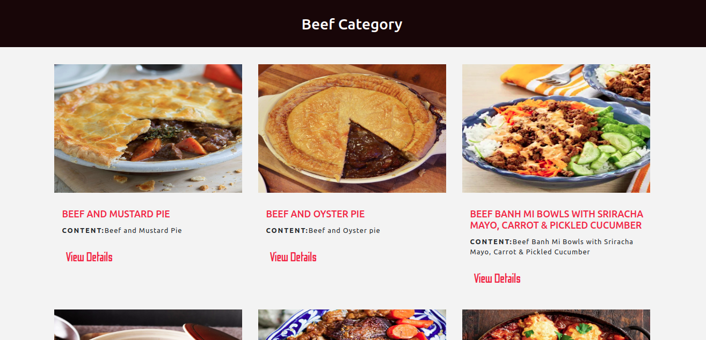

# RecipexApp

### Description
This is a capstone project built with React & Redux to retrieve and display recipe data from [TheMealDB.com](https://www.themealdb.com/api.php)



## Built With

- HTML5,
- Node.js
- React
- React-DOM
- Redux
- React-Create-App
- npm
- CSS
- ES6

## Live Demo

[Live Demo Link]( https://recipes-catelogue.netlify.app)

## Installation

1. Clone the repository in your local folder.

```
https://github.com/lekegitrepo/recipexapp.git
```

2. Run

### `npm install` or `yarn install`

## Load the app in a browser

#### Run:

### `yarn start` or `npm start`

Runs the app in the development mode.<br />
Open [http://localhost:3000](http://localhost:3000) to view it in the browser.

## Test

#### Run:

### `yarn test` or `npm test`


## Author

👤 **Temitayo Adeleke**

- Github: [@lekegitrepo](https://github.com/lekegitrepo)
- Twitter: [@leketemi](https://twitter.com/leketemi)
- Linkedin: [linkedin](https://www.linkedin.com/in/temitayo-adeleke/)

## 🤝 Contributing

Contributions, issues and feature requests are welcome!

Feel free to check the [issues page](https://github.com/lekegitrepo/recipexapp/issues).

## Show your support

Give a ⭐️ if you like this project!

## 📝 License

This project is [MiT](https://opensource.org/licenses/MIT) licensed.

## Acknowledgment

Design idea by [Marc-Antoine Roy on Behance](https://www.behance.net/gallery/11351281/NomNom)
